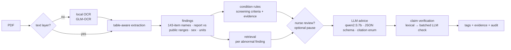

# Health Report Reader 健檢報告解讀器

**Reads any Taiwanese health-check report PDF (any layout, text or scanned) and turns it into structured, checked lab
findings and evidence-backed health tags, fully on a local GPU.**

[繁體中文說明](README.zh-TW.md) · 


| | |
|---|---|
| **Lab findings** | abnormal-item F1 **0.991** with **0 false positives** on 60 synthetic reports in 6 layouts (3 of them scanned) |
| **Conditions** | screening-rule condition F1 **0.95**, each with the values that triggered it |
| **Advice** | cites only passages the model was shown; 85% of citations verified, the rest dropped |
| **Speed / privacy** | about **10 s** per report (p50); nothing leaves the machine (socket-level egress test) |

## Why

Employers in Taiwan send employees to annual health checks, and every clinic prints its reports differently: the same
test appears as `AC sugar飯前血糖`, `GLU-AC` or `空腹血糖`, reference ranges are written in different ways, some reports
are scanned images. Before anyone can act on a report, a person has to read it line by line. This project reads the
document, normalises it into one format, checks every value against **both** the range printed on the report and a
public reference range, and only then lets a local LLM write advice, which must cite its source.

**Background.** This is my AI internship project at H2U (永悅健康), done through NCCU's AI internship program. The
public version has the company data removed: it runs on synthetic reports and public reference ranges only, and
contains no H2U data or internal material. (During the internship, a sample of 10 real reports showed 124 lab items
under 423 different names.) It is not an official H2U product.

## Who uses it for what

| User | Use | What the project provides |
|---|---|---|
| **Employee / patient** | understand their own report | plain-language summary, abnormal items with both reference ranges, cited advice, trends across reports |
| **Nurse / health manager** | find who needs follow-up, without trusting the machine blindly | screening-rule conditions with evidence, an optional **review step** that pauses before any advice is written, an audit panel |
| **Health-check centre / platform** | turn many clinics' layouts into one dataset | 143-item canonical names, JSON/CSV per report, and `batch.py`: one `findings_all.csv` across every report |
| **Developer** | build on it | Python API, a LangGraph workflow, LangChain retriever + tools |
| **Evaluator / researcher** | test a document-AI system | a deterministic synthetic report generator (60 reports, 6 layouts, gold labels) and the evaluation harness |

## How it works



The flow runs as a **LangGraph** `StateGraph` ([docs/graph.md](docs/graph.md)): rules and retrieval run in parallel, the
review step is a LangGraph `interrupt` (state kept in memory only), and progress and the LLM's output stream to the UI.

| Problem | Design decision |
|---|---|
| Every clinic names and ranges tests differently | canonical synonym table (143 items) + NFKC normalisation; each value is judged against the printed range **and** a public range, and disagreements are flagged ⚠ |
| LLMs make up numbers and diagnoses | values, abnormal flags and lab-derived conditions come from rules (e.g. metabolic syndrome = 3 of 5 criteria), never from the LLM |
| Advice drifts into generic filler | retrieval is driven by *this* report's findings; the JSON schema only lets the model cite passages it was shown; unsupported advice is dropped |
| A wrong screening flag should not turn into advice | optional nurse review: remove a flagged condition before the LLM runs, recorded in the audit |
| Health data is sensitive | all models run locally (Ollama); web search is off by default; LangSmith tracing is forced off even if the environment enables it (tested) |

## Results

Every change was measured before it was kept, and changes that made things worse were removed. Numbers are from a
**fully synthetic** set of 60 reports that ships with this repo and an internal set of 12 real de-identified reports
(not published).

| Round | Change | Key result |
|---|---|---|
| R0 | original prototype | crashed on every real report; the LLM silently saw only the last 2,050 of ~14,000 prompt tokens |
| R1 | explicit context size, schema-constrained output, citation enum | valid outputs 0/12 → 12/12, latency 40 s → 20 s |
| R2 | findings extraction rewrite | abnormal F1 0.50 → **1.00** on real reports (0 false positives) |
| R3–R4 | report-driven retrieval; hybrid + reranker ablation | best retrieval score came from hybrid + rerank, **but end-to-end advice got worse** (26% → 17%), so it is off |
| R5 | screening-rule conditions + claim verification | condition recall 0.05 → **0.33** on real reports |
| R6–R7 | egress test, local OCR, Gradio UI | 0 outbound connections by default |
| R8 | LangGraph rewrite loop vs dropping unsupported advice | +3 pts, within run-to-run noise: off by default |
| R9 | leaner prompt; knowledge-base ablation | latency p50 17 s → **9 s** at equal quality; 57 targeted passages beat a generic corpus, but 152 passages did *worse*, so 57 stay |
| R10 | LangGraph as the only orchestration path; nurse review; batch CLI | identical outputs to the hand-wired pipeline on 72 reports (deterministic fake LLM); with the real LLM every quality metric is unchanged and LangGraph adds 0.02 s per report |

Release run (60 synthetic reports, R10): abnormal F1 0.991 (0 FP; all 5 misses are in one scanned PDF), condition
F1 0.95, risk F1 0.88, 85% of citations supported, advice directly relevant 49%, p50 9.6–10.5 s on an RTX 4060 Laptop
GPU.
Full history and ablation tables: [eval/HISTORY.md](eval/HISTORY.md).

## Quick start

Requirements: Python 3.11, [Ollama](https://ollama.com), an NVIDIA GPU with ≥8 GB VRAM recommended.

```bash
ollama pull qwen2.5:7b
ollama pull qwen3-embedding:0.6b
ollama pull glm-ocr                                  # optional, for scanned PDFs

python -m venv .venv && .venv/Scripts/activate       # Windows (Linux/macOS: source .venv/bin/activate)
pip install -r requirements.txt
```

**UI** (patients, nurses)

```bash
python ui.py                                         # http://127.0.0.1:7860 — tick "護理師審核" for the review step
python ui.py --demo-stub                             # try the UI without any model
```

**Batch** (health-check centres, platforms)

```bash
python batch.py reports/ --out results/              # per-report JSON/CSV + summary.csv + findings_all.csv
python batch.py reports/ --no-llm                    # findings and rule conditions only; no Ollama needed
```

**Python API** (developers)

```python
from pipeline import analyze_pdf
r = analyze_pdf(open("report.pdf", "rb").read())   # retrieval: fact sheets only; pass retriever= for a KB
r.findings                  # normalised lab values: canonical key, value, unit, status, both ranges
r.tags                      # conditions, risks, metrics, advice; each tag with its source and verdict

from graph_workflow import resume_review, run_graph
r = run_graph(open("report.pdf", "rb").read(), review=True)      # pauses when the rules flag something
if r.pending_review:
    r = resume_review(r.pending_review["token"], {"remove": {"conditions": ["過重"]}})
```

LangChain components (`pip install -r requirements-langchain.txt`): `integrations/langchain/` exposes the retriever as a
`BaseRetriever` and two deterministic tools (`analyze_health_report`, `lookup_reference_range`); see
`examples/langchain_agent_demo.py` and `examples/langchain_rag_chain.py`.

Docker: `docker compose up --build` (NVIDIA container toolkit required).

**Evaluation** (researchers)

```bash
pytest -q                                            # unit, privacy and UI tests; no GPU needed
python eval/test_abnormal.py                         # findings regression set
python eval/run_eval.py                              # end-to-end on the 60 synthetic reports
python eval/synth/generate.py                        # regenerate the synthetic set (seed 20260925)
```

## Privacy and limitations

* All models run locally. Web search is off by default; when enabled only a canonical item name ("收縮壓 偏高 衛教")
  can leave the machine. The report cache and exports never store the report text.
* Rule conditions are **screening flags from a single report**, not diagnoses (e.g. one fasting-glucose value).
* Scanned reports depend on the OCR model; they account for every miss on the synthetic set.
* LH/FSH are judged against adult sex-specific ranges without cycle or menopause context.
* Advice quality depends on the knowledge base: about half of the advice is judged directly relevant. Bring a larger
  curated corpus in the same format (`data/kb_sample.README.md`) for richer advice.
* Planned: FHIR Observation export with LOINC codes; a dedicated OCR evaluation.

## Data

* `data/reference_ranges.json`: adult reference ranges from public sources (Taiwan Health Promotion Administration,
  Taiwanese society guidelines, KDIGO, WHO, MedlinePlus), each with a citation. The printed range always takes precedence.
* `data/kb_sample.json`: 57 health-education passages written for this project, each citing its public source;
  `data/kb_sample_extended.json` has 152 (measured worse, R9).
* No real patient data is included anywhere in this repository. All sample reports are synthetic.

## Disclaimer

For health-information purposes only. It does not provide medical diagnosis and is not a medical device; consult a
physician about your results.

## License

MIT
