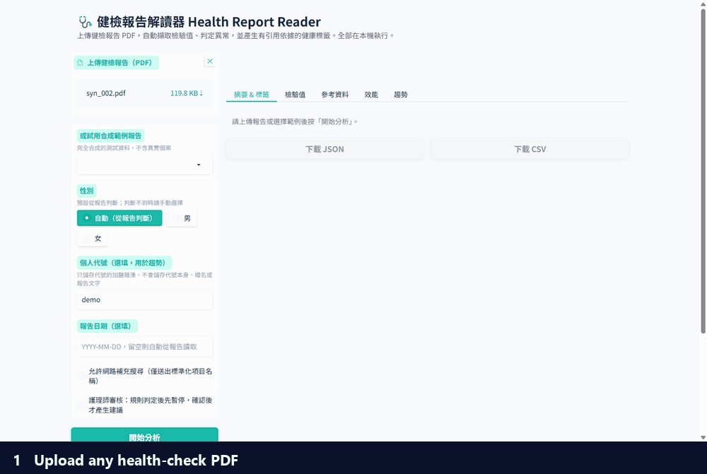
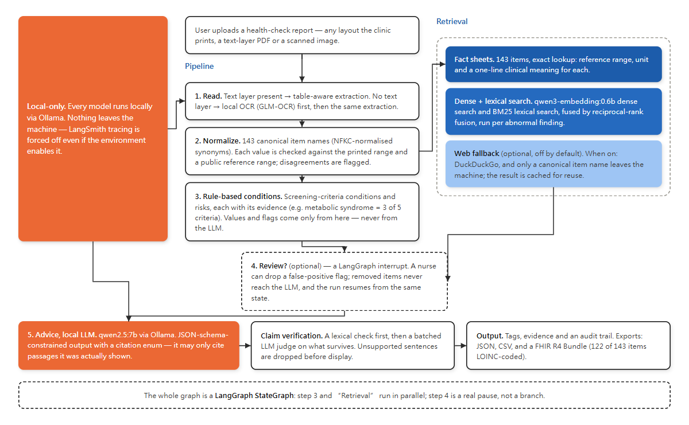
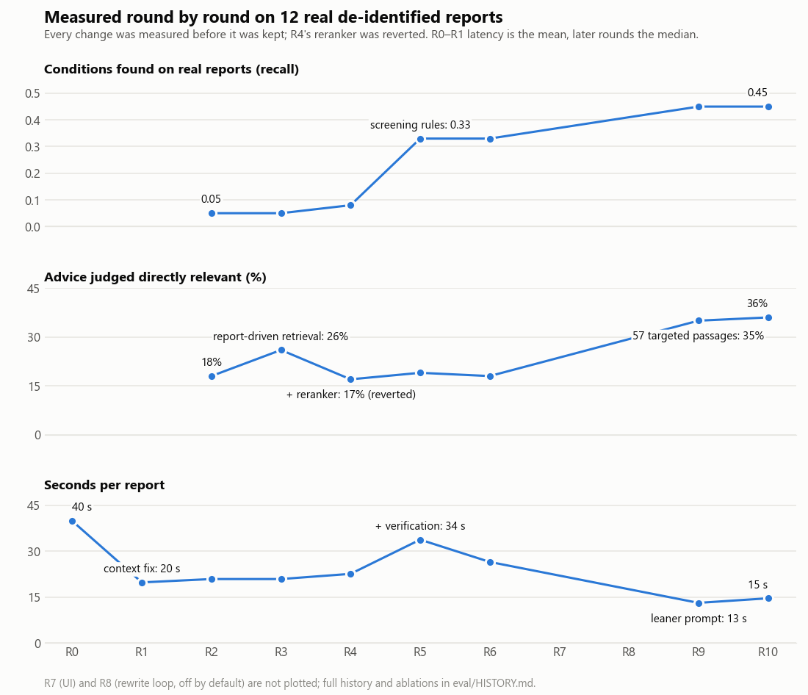

# Health Report Reader 健檢報告解讀器

[繁體中文說明](README.zh-TW.md) · 

> **Reads any Taiwanese health-check report PDF (any layout, text or scanned) and turns it into structured, checked
> lab findings and evidence-backed health tags, fully on a local GPU.**
>
> Internship project — my AI internship, through NCCU's AI internship program (see Background below). The public
> version has the employer's data removed.
>
> License: [MIT](LICENSE) · Measurement log: [eval/HISTORY.md](eval/HISTORY.md)



A patient or nurse uploads a PDF — any layout, text or scanned. The reader extracts every lab value, checks each one
against two reference ranges, flags screening conditions with evidence, and — after an optional nurse review — a
local LLM writes advice that may only cite passages it was actually shown.

| | |
|---|---|
| **Lab findings** | abnormal-item F1 **0.991** with **0 false positives** on 60 synthetic reports in 6 layouts (3 of them scanned) |
| **Scanned PDFs** | 60 test scans at three quality levels: abnormal-item F1 **0.91–0.93**, precision **≥ 0.95** (local OCR) |
| **Conditions** | screening-rule condition F1 **0.95**, each with the values that triggered it |
| **Advice** | cites only passages the model was shown; 85% of citations verified, the rest dropped |
| **Speed / privacy** | about **10 s** per report (first results in under 1 s); nothing leaves the machine (tested) |

## Why Health Report Reader

Employers in Taiwan send employees to annual health checks, and every clinic prints its reports differently: the same
test appears as `AC sugar飯前血糖`, `GLU-AC` or `空腹血糖`, reference ranges are written in different ways, and some
reports are scanned images. Before anyone can act on a report, a person has to read it line by line. This project
reads the document, normalises it into one format, checks every value against **both** the range printed on the
report and a public reference range, and only then lets a local LLM write advice, which must cite its source.

**Background.** This is my AI internship project at H2U (永悅健康), done through NCCU's AI internship program. The
public version has the company data removed: it runs on synthetic reports and public reference ranges only, and
contains no H2U data or internal material. (During the internship, a sample of 10 real reports showed 124 lab items
under 423 different names.) It is not an official H2U product.

## What it solves

| Pain | How it's handled |
|---|---|
| Every clinic names and ranges tests differently | a 143-item synonym table; each value is checked against the printed range **and** a public range, and disagreements are flagged ⚠ |
| LLMs make up numbers and diagnoses | values, abnormal flags and lab-derived conditions come from rules — never from the LLM |
| Advice drifts into generic filler | retrieval is driven by *this* report's findings; the schema only lets the model cite passages it was shown; unsupported advice is dropped |
| A wrong screening flag shouldn't become advice | an optional nurse review pauses the graph before any advice is written |
| Other systems need standard data, not another CSV layout | a FHIR R4 Bundle with one LOINC-coded `Observation` per value; 122 of 143 items mapped, the rest left uncoded on purpose |
| Health data is sensitive | every model runs locally; web search and LangSmith tracing are off by default (tested) |

## Architecture

<picture>
  <source media="(prefers-color-scheme: dark)" srcset="docs/img/architecture_dark.png">
  
</picture>

The whole flow is a **LangGraph** `StateGraph` ([docs/graph.md](docs/graph.md)): rules and retrieval run in parallel,
review is a pause rather than a branch — a LangGraph `interrupt` that resumes from the same state once a nurse
confirms or edits the flags — and progress and the LLM's output stream live to the UI. Every model runs locally via
Ollama: qwen2.5:7b (advice), qwen3-embedding:0.6b (retrieval), GLM-OCR (scans).

**Verified:** LangGraph produces identical output to the hand-wired pipeline on 72 reports (deterministic fake LLM);
with the real LLM every quality metric is unchanged, and orchestration adds 0.02 s per report.

## Quick start

Requirements: Python 3.11, [Ollama](https://ollama.com), an NVIDIA GPU with ≥8 GB VRAM recommended.

```bash
ollama pull qwen2.5:7b
ollama pull qwen3-embedding:0.6b
ollama pull glm-ocr                  # optional, for scanned PDFs

python -m venv .venv
.venv/Scripts/activate               # Windows; Linux/macOS: source .venv/bin/activate
pip install -r requirements.txt
```

**UI** (patients, nurses)

```bash
python ui.py                         # http://127.0.0.1:7860; downloads JSON, CSV, FHIR
python ui.py --demo-stub             # try the UI without any model
```

Tick **護理師審核** (nurse review) to pause after the rules, so a nurse can confirm the flags before any advice is
written.

**Batch** (health-check centres, platforms)

```bash
# JSON/CSV per report, plus summary.csv and findings_all.csv across all reports
python batch.py reports/ --out results/
python batch.py reports/ --no-llm         # findings and rule flags only, no Ollama
python batch.py reports/ --fhir           # adds <name>.fhir.json (FHIR R4 + LOINC)
```

**Python API** (developers)

```python
from pipeline import analyze_pdf

# retrieval uses the built-in fact sheets; pass retriever= to add a knowledge base
r = analyze_pdf(open("report.pdf", "rb").read())
r.findings  # normalised lab values: key, value, unit, status, both ranges
r.tags      # conditions, risks, metrics, advice; each with its source and verdict

from graph_workflow import resume_review, run_graph

# review=True pauses when the rules flag something
r = run_graph(open("report.pdf", "rb").read(), review=True)
if r.pending_review:
    r = resume_review(r.pending_review["token"], {"remove": {"conditions": ["過重"]}})
```

LangChain components (`pip install -r requirements-langchain.txt`): `integrations/langchain/` exposes the retriever as a
`BaseRetriever` and two deterministic tools (`analyze_health_report`, `lookup_reference_range`); see
`examples/langchain_agent_demo.py` and `examples/langchain_rag_chain.py`.

Docker: `docker compose up --build` (NVIDIA container toolkit required).

**Evaluation** (researchers)

```bash
pytest -q                            # unit, privacy and UI tests; no GPU needed
python eval/test_abnormal.py         # findings regression set
python eval/run_eval.py              # end-to-end on the 60 synthetic reports
python eval/ocr_eval.py              # OCR on scans at 3 quality levels (needs glm-ocr)
python eval/synth/generate.py        # regenerate the synthetic set (seed 20260925)
```

## Try it: one report, end to end

Synthetic report `eval/synth/samples/syn_002.pdf` (female, 32 lab values). An excerpt of what is printed:

| Printed name | Result | Unit | Printed range | Flag |
|---|---|---|---|---|
| BMI 身體質量指數 | 25.3 | kg/m2 | 18.5~24.0 | H |
| 尿酸 Uric Acid | 7.2 | mg/dL | 男:3.5~7.2 女:2.6~6.0 | H |
| HDL-Cholesterol | 33 | mg/dL | >40 | L |
| Triglyceride 三酸甘油脂 | 248 | mg/dL | 35~150 | H |
| 空腹血糖 FBS | 117 | mg/dL | 70~100 | H |
| MCHC | 35.0 | g/dL | 31.5~36.0 | |

**Steps 1–2, findings (rules, 0.5 s).** 32 values read and mapped to standard items, 6 abnormal:

| Standard item | Value | Result | Why |
|---|---|---|---|
| 尿酸 uric acid | 7.2 mg/dL | **high** | the header says female, so the female range 2.6–6.0 applies, not the male one |
| 高密度脂蛋白膽固醇 HDL | 33 mg/dL | **low** | printed range > 40 |
| 三酸甘油脂 triglycerides | 248 mg/dL | **high** | printed range 35–150 |
| 平均紅血球血色素濃度 MCHC | 35 g/dL | normal **⚠** | printed range says normal, the public range (31–34.9) says high: flagged for a person to look at |

**Step 3, screening flags with evidence.** 代謝症候群 metabolic syndrome, *4 of 5 criteria: systolic BP 134, fasting
glucose 117, triglycerides 248, HDL 33*; 糖尿病前期 prediabetes, *fasting glucose 117*; 血脂異常, 血壓偏高, 過重,
高尿酸血症; and risks such as 心血管疾病 (from 血脂異常).

**Step 4, optional review.** A nurse can untick a flag (for example 過重) before any advice is written; it then never
reaches the LLM and the removal is recorded.

**Step 5, advice (local LLM, 11.7 s in total).** Lifestyle 規律運動 · 限酒戒菸 · 均衡飲食; food 減少含糖飲料 ·
增加全穀類; exercise 中等強度運動; avoid 避免大量飲酒 · 避免吸菸. Each tag cites a knowledge-base passage; 9 of 10
citations were verified and the unsupported one was dropped. For example, 減少含糖飲料 cites passage `kb_3_0`
「改善三酸甘油脂的生活調整」, written from a Health Promotion Administration page, and the verifier found the advice in
that passage.

## Who uses it for what

| User | Use | What the project provides |
|---|---|---|
| **Employee / patient** | understand their own report | plain-language summary, abnormal items with both reference ranges, cited advice, trends across reports |
| **Nurse / health manager** | find who needs follow-up, without trusting the machine blindly | screening-rule flags with evidence, an optional **review step** that pauses before any advice is written, an audit panel |
| **Health-check centre / platform** | turn many clinics' layouts into one dataset | 143 standard item names, JSON/CSV per report, `batch.py` with one `findings_all.csv` across every report, and a **FHIR R4** export with LOINC codes |
| **Developer** | build on it | Python API, a LangGraph workflow, LangChain retriever + tools |
| **Evaluator / researcher** | test a document-AI system | a deterministic synthetic report generator (60 reports, 6 layouts, gold labels) and the evaluation harness |

## Results

Every change was measured before it was kept, and changes that made things worse were removed. 440 tests (unit,
privacy, LangGraph and UI) run before each change is kept.

<picture>
  <source media="(prefers-color-scheme: dark)" srcset="docs/img/metrics_dark.png">
  
</picture>

<details><summary>Round-by-round table</summary>

Numbers are from a **fully synthetic** set of 60 reports that ships with this repo and an internal set of 12 real
de-identified reports (not published).

| Round | Change | Key result |
|---|---|---|
| R0 | original prototype | crashed on every real report; the LLM silently saw only the last 2,050 of ~14,000 prompt tokens |
| R1 | explicit context size, schema-constrained output, citation enum | valid outputs 0/12 → 12/12, latency 40 s → 20 s |
| R2 | findings extraction rewrite | abnormal F1 0.50 → **1.00** on real reports (0 false positives) |
| R3–R4 | report-driven retrieval; hybrid + reranker ablation | best retrieval score came from hybrid + rerank, **but end-to-end advice got worse** (26% → 17%), so it is off |
| R5 | screening-rule conditions + claim verification | condition recall 0.05 → **0.33** on real reports |
| R6–R7 | egress test, local OCR, Gradio UI | 0 outbound connections by default |
| R8 | LangGraph rewrite loop vs dropping unsupported advice | +3 pts, within run-to-run noise: off by default |
| R9 | leaner prompt; knowledge-base ablation | latency p50 17 s → **9 s** at equal quality; 57 targeted passages beat a generic corpus, but 152 passages did *worse*, so 57 stay |
| R10 | LangGraph as the only orchestration path; nurse review; batch CLI | identical outputs to the hand-wired pipeline on 72 reports (deterministic fake LLM); with the real LLM every quality metric is unchanged and LangGraph adds 0.02 s per report |
| R11 | OCR evaluation (60 scans, 3 quality levels) and fixes; FHIR export | scan abnormal F1 0.60–0.85 → **0.91–0.93**, false positives 55 → 5; FHIR R4 with LOINC codes for 122 of 143 items |

Release run (60 synthetic reports, R10): abnormal F1 0.991 (0 FP; all 5 misses are in one scanned PDF), condition F1
0.95, risk F1 0.88, 85% of citations supported, advice directly relevant 49%, p50 9.6–10.5 s on an RTX 4060 Laptop GPU.
Full history and ablation tables: [eval/HISTORY.md](eval/HISTORY.md).

</details>

## Tech stack

**Pipeline** Python 3.11 · LangGraph `StateGraph` · pdfplumber + pypdfium2 (PDF and table extraction)
**Models** (all local via Ollama) qwen2.5:7b (advice) · qwen3-embedding:0.6b (retrieval) · GLM-OCR (scans)
**UI / batch** Gradio (streaming, review, trends) · `batch.py` CLI
**Interop** FHIR R4 (`fhir.resources`) with LOINC coding
**Eval** pytest · a deterministic synthetic report generator (60 reports, 6 layouts) · an OCR evaluation harness

## Project structure

```
pipeline.py            analysis stages and the analyze_pdf() entry point
graph_workflow.py      LangGraph StateGraph: parallel rules/retrieval, review interrupt
pdf_utils.py, ocr.py   PDF text and table extraction; local OCR for scanned pages
abnormal.py            item-name normalisation, value and range parsing, abnormal flags
conditions.py          screening-criteria conditions and risks, with evidence
retrieval.py           per-finding retrieval, fact sheets, optional BM25/reranker
llm.py, verify.py      schema-constrained advice (citation enum); claim verification
ui.py, batch.py        Gradio UI (streaming, review, trends, exports); bulk CLI
fhir_export.py         FHIR R4 Bundle export (LOINC codes from data/loinc_map.json)
storage.py             trend store keyed by a salted ID, never the name
web_fallback.py        optional web search, off by default (canonical item names only)
integrations/          LangChain retriever and tools
data/                  reference ranges, lab synonyms, LOINC map, knowledge base
eval/                  evaluation harness, OCR evaluation, synthetic reports, history
tests/                 unit, privacy (egress, tracing), LangGraph and UI tests
```

## Privacy and limitations

* All models run locally. Web search is off by default; when enabled only a canonical item name ("收縮壓 偏高 衛教")
  can leave the machine. The report cache and exports never store the report text.
* Rule conditions are **screening flags from a single report**, not diagnoses (e.g. one fasting-glucose value).
* Scans are weaker than text-layer PDFs: on 60 test scans the OCR drops rows in two-column and heavily degraded
  pages (72–81% of values read), while what it does return is reliable (precision ≥ 0.95). See R11 in
  [eval/HISTORY.md](eval/HISTORY.md).
* LH/FSH are judged against adult sex-specific ranges without cycle or menopause context.
* The one-line summary is written by the LLM and is not verified claim by claim (the tags are); in the example above it
  says 高血壓 where the rules say 血壓偏高.
* Advice quality depends on the knowledge base: about half of the advice is judged directly relevant. Bring a larger
  curated corpus in the same format (`data/kb_sample.README.md`) for richer advice.
* The LOINC mapping is for interoperability demos; review it before any clinical use.
* Planned: better row recovery for two-column and heavily degraded scans.

## Data

* `data/reference_ranges.json`: adult reference ranges from public sources (Taiwan Health Promotion Administration,
  Taiwanese society guidelines, KDIGO, WHO, MedlinePlus), each with a citation. The printed range always takes precedence.
* `data/loinc_map.json`: LOINC code, long name and UCUM unit for 122 of the 143 items (high/medium confidence, with
  notes); for demos, to be reviewed before clinical use. Contains content from LOINC® (http://loinc.org), see
  `data/loinc_map.README.md` for the notice.
* `data/kb_sample.json`: 57 health-education passages written for this project, each citing its public source;
  `data/kb_sample_extended.json` has 152 (measured worse, R9).
* No real patient data is included anywhere in this repository. All sample reports are synthetic.

## Disclaimer

For health-information purposes only. It does not provide medical diagnosis and is not a medical device; consult a
physician about your results.

## License

MIT
