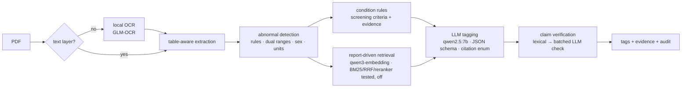

# Health Report Tagger 健檢報告標籤器

**Turn a Taiwanese health-check PDF into grounded, verifiable health tags — entirely on a local GPU.**

[繁體中文說明](README.zh-TW.md) · 

Employers in Taiwan send millions of employees to annual health checks. The reports that come back are hard to use:
every clinic prints different item names and reference ranges, nurses read them one by one, and employees see a page of
red numbers without knowing what to do next. This project reads **any** report layout and produces structured tags —
conditions, risks, metrics, and diet / exercise / lifestyle advice — where **every tag carries its evidence** and nothing
leaves the machine.

<!-- screenshot: docs/img/findings.png -->

## Why it is built this way

| Problem | Design decision |
|---|---|
| Each lab prints different names (`AC sugar飯前血糖`, `GLU-AC`, `空腹血糖`) and different reference ranges | Canonical synonym table (143 items) + NFKC normalisation; every value is judged against **both** the report-printed range and a public reference range, and disagreements are flagged ⚠ |
| LLMs hallucinate numbers and diagnoses | Numbers and abnormal flags are computed by rules — the LLM never writes a value. Conditions follow published screening criteria (e.g. metabolic syndrome ≥3 of 5) and carry their evidence |
| Advice drifts into generic boilerplate or nonsense | Retrieval is driven by *this* patient's abnormal findings; the LLM may only cite passages it was shown (JSON-schema enum); a verification layer drops advice its cited passage does not support |
| Health data is sensitive personal data | All models run locally via Ollama. Web search is off by default; when enabled only a canonical item name ("收縮壓 偏高 衛教") can leave the machine — enforced by construction and by a socket-level egress test |
| Scanned reports | Pages without a text layer go through a local OCR model |

## Pipeline



## Results (evaluation-driven, round by round)

Every change was measured before it was kept. Numbers below: internal set of 12 real de-identified reports (not
published) and a **fully synthetic** set of 60 reports that ships with this repo.

| Round | Change | Key result |
|---|---|---|
| R0 | original prototype | crashed on every real report; the LLM silently saw only the last 2,050 of ~14,000 prompt tokens |
| R1 | explicit context size, schema-constrained output, citation enum | valid outputs 0/12 → 12/12, micro-F1 0 → 0.29, latency 40 s → 20 s |
| R2 | abnormal-detection rewrite | abnormal F1 0.50 → **1.00** (0 false positives); synthetic set: **1.00** on 261 abnormal items |
| R3 | report-driven retrieval, KB cleaning, embedding A/B | retrieval nDCG@5 0.283 → **0.541** (qwen3-embedding vs nomic) |
| R4 | BM25 + RRF + cross-encoder reranker (ablation) | hybrid alone *hurt* (0.481); hybrid + rerank best retrieval score (0.570) — **but end-to-end advice relevance fell** (26% → 17%, worse on 10 of 12 reports), so dense-only is the default |
| R5 | screening-criteria condition rules + claim verification | condition recall 0.05 → **0.33**; synthetic condition F1 **0.92**, abnormal F1 **0.991**; verification drops unsupported advice (27% internal; 88% of synthetic citations supported) |
| R6 | privacy (egress test) + OCR | 0 outbound connections by default (tested); verification judge batching fixed a second silent-truncation bug (30 → 0 unverified) |
| R7 | Gradio UI | range-conflict explanations, citation drill-down, timing & grounding panels |
| R8 | LangGraph generate → verify ⇄ rewrite (ablation vs drop) | rewrite: +3 pts advice relevance on both sets, but only 3 of 59 unsupported tags rescued (+3 s) and +3 pts is within run-to-run noise, so it is off by default |
| R9 | leaner prompt (rules own lab-derived conditions); knowledge-base ablation | LLM latency p50 17 s → **9 s** at equal advice quality. KB content beats retrieval tricks: 57 targeted passages vs a generic corpus, advice relevance 43% vs 30% (synthetic) and 35% vs 25% (real reports), but growing the KB to 152 passages *lowered* it (35% / 16%), so 57 stays the default. Release run, 60 synthetic reports: condition F1 **0.95**, risk F1 **0.88**, abnormal F1 **0.991** (0 false positives), 85% of citations supported, p50 **9.6 s** |

Full history: [eval/HISTORY.md](eval/HISTORY.md) · retrieval ablation: [eval/retrieval_bench.py](eval/retrieval_bench.py)

> The retrieval numbers (R3/R4) were measured on a private ~3,600-passage Chinese health-education corpus that cannot
> be redistributed. The repo ships the public 57-passage KB used from R6 on (`data/kb_sample.json`), so re-running the
> benchmark here gives different absolute numbers; the method (40 queries, pooled top-10, local-LLM relevance
> judgments) is identical.

## Quick start

Requirements: Python 3.11, [Ollama](https://ollama.com), an NVIDIA GPU with ≥8 GB VRAM recommended.

```bash
ollama pull qwen2.5:7b
ollama pull qwen3-embedding:0.6b
ollama pull glm-ocr                 # optional, for scanned PDFs

python -m venv .venv && .venv/Scripts/activate      # Windows (Linux/macOS: source .venv/bin/activate)
pip install -r requirements.txt                      # add requirements-rerank.txt for the reranker
python ui.py                                         # http://127.0.0.1:7860
python ui.py --demo-stub                             # UI demo without any model
```

Docker: `docker compose up --build` (NVIDIA container toolkit required).

## Evaluation

```bash
pytest -q                                            # unit + privacy tests, no GPU needed
python eval/test_abnormal.py                         # abnormal-flagging regression set
python eval/run_eval.py --samples eval/synth/samples --gt eval/synth/ground_truth.json \
       --mode hybrid --rerank                        # end-to-end on the synthetic set
python eval/retrieval_bench.py --systems all         # retrieval ablation with LLM-judged pooling
```

The synthetic dataset is generated deterministically (`eval/synth/generate.py`, seed 20260925): 60 reports, six layouts
(including two-column, full-width digits, inline H/L flags and 3 scanned image-only PDFs), 11 clinical scenarios, and
gold labels derived by rule from the same values that were rendered.

## LangChain / LangGraph integration

The core pipeline is **framework-free on purpose**. Hand-built code gives the fine-grained control this task needs:
a per-request JSON-schema citation enum (the model can only cite chunks it was shown), a cheap-first verification
cascade (lexical check, then one batched LLM call only for what is left), per-component ablations (every stage can be
switched off and measured), and plain debuggability — the R0 silent-truncation bug was found by comparing Ollama's raw
`prompt_eval_count` with the prompt length, something a framework abstraction would have hidden.

`integrations/langchain/` exposes the same core as standard LangChain components without changing its behaviour:
`HealthReportRetriever` / `FindingsRetriever` (`BaseRetriever` → `Document`s with id / source / url / score metadata)
and two deterministic tools, `analyze_health_report` and `lookup_reference_range`. Being Runnables, they compose with
LCEL and can be used as LangGraph nodes or agent tools.

```python
from langchain_ollama import ChatOllama
from integrations.langchain import TOOLS, HealthReportRetriever
from kb_index import load_articles, prepare_chunks
from retrieval import BM25Index, Retriever

chunks, _ = prepare_chunks(load_articles("data/kb_sample.json"))
retriever = HealthReportRetriever(retriever=Retriever(None, mode="bm25", bm25=BM25Index(chunks, [])), k=4)
docs = retriever.invoke("LDL 偏高 飲食")                   # Documents with citation metadata
llm = ChatOllama(model="qwen2.5:7b", base_url="http://127.0.0.1:11434").bind_tools(TOOLS)
ai = llm.invoke("eval/synth/samples/syn_011.pdf 有哪些異常？LDL 的參考範圍？")  # -> tool_calls
```

```bash
pip install -r requirements-langchain.txt
python examples/langchain_agent_demo.py     # tool calling over a synthetic report
python examples/langchain_rag_chain.py      # retriever | prompt | ChatOllama | StrOutputParser, with [id] citations
```

## Data

* `data/reference_ranges.json` — adult reference ranges compiled from public sources (Taiwan Health Promotion
  Administration, Taiwanese society guidelines, a university-hospital lab page, KDIGO, WHO, MedlinePlus), each with a
  citation. The range printed on the report always takes precedence.
* `data/kb_sample.json` — 57 short health-education passages written for this project (the default), each citing the
  public page it is based on and tagged with the findings it is for (`applies_to`). `data/kb_sample_extended.json`
  adds 95 more; it measured *worse* (R9), so it is not the default. See `data/kb_sample.README.md`; optional
  per-finding routing with `Retriever(route_by_tags=True)`. Bring your own corpus in the same format.
* No real patient data is included anywhere in this repository.

## Disclaimer

For health-information purposes only. It does not provide medical diagnosis and is not a medical device; consult a
physician about your results.

## License

MIT
