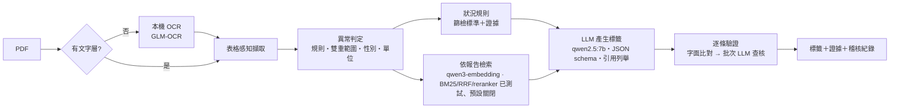

# 健檢報告標籤器 Health Report Tagger

**把台灣健檢報告 PDF 轉成「有依據、可驗證」的健康標籤，全程在本機顯卡上執行。**

[English](README.md)

台灣企業每年安排大量員工健檢，但報告回來後很難被好好利用：每家院所的項目名稱與參考範圍都不同，護理師只能逐份人工判讀，員工則拿到一整頁紅字，卻不知道下一步該怎麼做。本專案能讀取**任何排版**的報告，產生結構化標籤（健康狀況、風險、關鍵數值，以及飲食／運動／生活建議），**每一個標籤都附上依據**，資料也不會離開本機。

## 設計理念

| 問題 | 設計決策 |
|---|---|
| 各院所項目名稱不同（`AC sugar飯前血糖`、`GLU-AC`、`空腹血糖`），參考範圍也不同 | 143 項標準同義詞表＋NFKC 正規化；每個數值**同時**比對「報告印製範圍」與「公開參考範圍」，兩者不一致時標示 ⚠ |
| LLM 會捏造數值與診斷 | 數值與異常判定全部由規則計算，LLM 從不寫數字。健康狀況依公開篩檢標準判定（例如代謝症候群需符合 5 項中 3 項），並附上證據 |
| 建議容易空泛或離譜 | 依「這位受檢者」的異常項目檢索；LLM 只能引用實際看到的段落（JSON schema 列舉）；驗證層會刪除引用段落不支持的建議 |
| 健康資料屬於敏感個資 | 所有模型透過 Ollama 在本機執行。網路搜尋預設關閉；開啟時只會送出標準化項目名稱（例如「收縮壓 偏高 衛教」），這點由程式結構保證，並有 socket 層級的外連測試 |
| 掃描檔報告 | 沒有文字層的頁面會交給本機 OCR 模型辨識 |

## 處理流程



## 成果（評估驅動、逐輪量測）

每一項改動都先量測再決定保留與否。數據來自兩個資料集：12 份真實去識別報告（內部，不公開），以及本 repo 附帶的 **60 份完全合成報告**。

| 輪次 | 改動 | 關鍵結果 |
|---|---|---|
| R0 | 原始原型 | 每份真實報告都崩潰；LLM 在沒有任何錯誤訊息的情況下，只看到約 14,000 token prompt 的最後 2,050 token |
| R1 | 明確設定 context 長度、schema 約束輸出、引用列舉 | 有效輸出 0/12 → 12/12，micro-F1 0 → 0.29，延遲 40 秒 → 20 秒 |
| R2 | 重寫異常判定 | 異常偵測 F1 0.50 → **1.00**（0 誤報）；合成集 261 個異常項目 **F1 1.00** |
| R3 | 依報告檢索、知識庫清理、embedding 比較 | 檢索 nDCG@5 0.283 → **0.541**（qwen3-embedding vs nomic） |
| R4 | BM25＋RRF＋cross-encoder 重排序（消融實驗） | 只加混合檢索反而**變差**（0.481）；混合＋重排序的檢索分數最高（0.570），**但端到端建議相關率下降**（26% → 17%，12 份中 10 份變差），因此預設只用語意檢索 |
| R5 | 依篩檢標準的狀況規則＋逐條驗證 | 狀況召回率 0.05 → **0.33**；合成集狀況 F1 **0.92**、異常偵測 F1 **0.991**；驗證刪除無依據建議（內部 27%；合成集 88% 引用有依據） |
| R6 | 隱私（外連測試）＋OCR | 預設 0 次對外連線（有測試證明）；修正查核批次造成的第二個靜默截斷 bug（無法驗證 30 → 0） |
| R7 | Gradio 介面 | 範圍衝突說明、引用展開、耗時與依據面板 |
| R8 | LangGraph 生成 → 驗證 ⇄ 重寫（與「刪除」做消融） | 重寫讓兩個資料集的建議相關率都 +3 個百分點，但 59 條無依據建議只救回 3 條（+3 秒），且 +3 點在重跑誤差範圍內，因此預設關閉 |
| R9 | 精簡 prompt（檢驗值推得的狀況完全交給規則）；知識庫消融 | LLM 延遲 p50 17 秒 → **9 秒**，建議品質不變。知識庫內容比檢索技巧重要：57 篇針對性衛教 vs 一般保健語料，建議相關率 43% vs 30%（合成）、35% vs 25%（真實報告）；但擴充到 152 篇反而**下降**（35% / 16%），因此維持 57 篇為預設。發佈版（60 份合成報告）：狀況 F1 **0.95**、風險 F1 **0.88**、異常 F1 **0.991**（0 誤報）、85% 引用有依據、p50 **9.6 秒** |

> R3/R4 的檢索數據是在一個約 3,600 段、無法再散布的私有中文衛教語料上量測的。本 repo 附的是 R6 起使用的 57 篇公開知識庫（`data/kb_sample.json`），在這裡重跑 benchmark 的絕對數字會不同，但方法完全相同：40 個查詢、pooled top-10、本機 LLM 判定相關性。

## 快速開始

需求：Python 3.11、[Ollama](https://ollama.com)，建議使用 8GB 以上 VRAM 的 NVIDIA 顯卡。

```bash
ollama pull qwen2.5:7b
ollama pull qwen3-embedding:0.6b
ollama pull glm-ocr                 # 選用：掃描檔 OCR

python -m venv .venv && .venv/Scripts/activate
pip install -r requirements.txt                      # 要使用 reranker 另裝 requirements-rerank.txt
python ui.py                                         # http://127.0.0.1:7860
python ui.py --demo-stub                             # 不需任何模型的介面示範
```

## 評估

```bash
pytest -q                                            # 單元與隱私測試，不需 GPU
python eval/test_abnormal.py                         # 異常判定回歸測試
python eval/run_eval.py --no-llm                     # 合成集異常偵測（不需 LLM）
python eval/run_eval.py --mode hybrid --rerank       # 合成集端到端評估
```

## LangChain / LangGraph 整合

核心流程**刻意不使用框架**。手寫程式碼能提供這個任務需要的細緻控制：每次請求動態產生的 JSON schema 引用列舉
（模型只能引用它實際看過的片段）、先便宜後昂貴的驗證串接（先做字面比對，剩下的才批次交給 LLM 判斷）、
逐元件消融（每個階段都能關掉並量測），以及直接的可除錯性——R0 的「提示被靜默截斷」問題，正是比對 Ollama 回傳的
原始 `prompt_eval_count` 與提示長度才發現的，框架的抽象層很可能會把它藏起來。

`integrations/langchain/` 在不改變核心行為的前提下，把同一套核心包裝成標準 LangChain 元件：
`HealthReportRetriever` / `FindingsRetriever`（`BaseRetriever`，回傳帶 id / source / url / score metadata 的
`Document`），以及兩個確定性工具 `analyze_health_report` 與 `lookup_reference_range`。它們都是 Runnable，
可以用 LCEL 串接，也能當作 LangGraph 節點或 agent 工具。

```python
from langchain_ollama import ChatOllama
from integrations.langchain import TOOLS, HealthReportRetriever
from kb_index import load_articles, prepare_chunks
from retrieval import BM25Index, Retriever

chunks, _ = prepare_chunks(load_articles("data/kb_sample.json"))
retriever = HealthReportRetriever(retriever=Retriever(None, mode="bm25", bm25=BM25Index(chunks, [])), k=4)
docs = retriever.invoke("LDL 偏高 飲食")                   # 帶引用 metadata 的 Documents
llm = ChatOllama(model="qwen2.5:7b", base_url="http://127.0.0.1:11434").bind_tools(TOOLS)
ai = llm.invoke("eval/synth/samples/syn_011.pdf 有哪些異常？LDL 的參考範圍？")  # -> tool_calls
```

```bash
pip install -r requirements-langchain.txt
python examples/langchain_agent_demo.py     # 以合成報告示範工具呼叫
python examples/langchain_rag_chain.py      # retriever | prompt | ChatOllama | StrOutputParser，附 [id] 引用
```

## 資料

* `data/reference_ranges.json`：由公開來源整理的成人參考範圍（國民健康署、台灣各醫學會指引、大學醫院檢驗參考值、KDIGO、WHO、MedlinePlus），每項都附出處。報告印製的範圍永遠優先。
* `data/kb_sample.json`：為本專案撰寫的 57 篇衛教短文（預設），每篇都附所依據的公開網頁，並以 `applies_to` 標明適用的異常項目。`data/kb_sample_extended.json` 另外多 95 篇，但實測**反而較差**（R9），所以不是預設。格式見 `data/kb_sample.README.md`；可用 `Retriever(route_by_tags=True)` 依異常項目路由檢索。可換成同格式的自有語料。
* 本 repo **不含任何真實病患資料**。

## 免責聲明

本工具僅供健康資訊參考，不提供醫療診斷，也不是醫療器材。檢查結果請諮詢醫師。

## 授權

MIT
