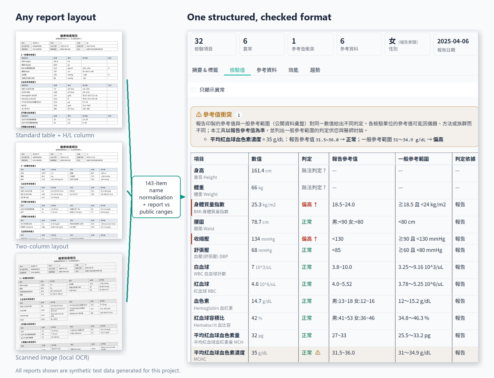
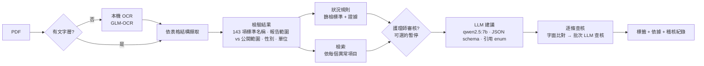

# 健檢報告解讀器 Health Report Reader

**讀取任何排版的台灣健檢報告 PDF（文字檔或掃描檔），轉成結構化、經過核對的檢驗結果，以及附有依據的健康標籤，全程在本機顯卡上執行。**

[English](README.md) · 



| | |
|---|---|
| **檢驗結果** | 60 份合成報告（6 種排版，其中 3 份為掃描檔），異常項目 F1 **0.991**、**零誤報** |
| **健康狀況** | 依篩檢標準判定，狀況 F1 **0.95**，每一項都附上觸發它的數值 |
| **建議** | 只能引用模型實際看到的資料；85% 的引用通過查核，其餘刪除 |
| **速度／隱私** | 每份報告約 **10 秒**（p50）；資料不離開本機（socket 層級外連測試） |

## 為什麼要做

台灣企業每年安排員工健檢，但每家院所印出的報告都不一樣：同一個檢驗項目可能寫成 `AC sugar飯前血糖`、`GLU-AC` 或
`空腹血糖`，參考範圍的寫法各不相同，有些報告還是掃描影像。在任何人能依報告採取行動之前，都得有人逐行讀過一遍。
本專案先讀懂文件、統一成同一種格式，每個數值**同時**比對「報告印製的參考值」與「公開參考範圍」，最後才讓本機 LLM
撰寫建議，而且建議必須引用來源。

**背景**：本專案是我在永悅健康（H2U）的 AI 實習專案（政大 AI 課程實習「政植計畫」）。公開版已移除所有公司資料：
只使用合成報告與公開參考範圍，不含任何 H2U 的資料或內部資料。（實習期間，10 份真實報告的樣本中，124 個檢驗項目
就出現了 423 種寫法。）本專案並非 H2U 的正式產品。

## 誰用、用來做什麼

| 使用者 | 用途 | 本專案提供 |
|---|---|---|
| **受檢者** | 看懂自己的報告 | 白話摘要、標出異常並列出兩種參考範圍、有引用的建議、歷次趨勢 |
| **護理師／健康管理人員** | 找出需要追蹤的人，但不盲目相信機器 | 附證據的篩檢規則判定、可選的**審核步驟**（產生建議前先暫停）、稽核紀錄 |
| **健檢中心／健康平台** | 把各院所的格式整合成同一份資料 | 143 項標準名稱、每份報告的 JSON/CSV，以及 `batch.py`：所有報告合成一張 `findings_all.csv` |
| **開發者** | 在此基礎上開發 | Python API、LangGraph 工作流、LangChain retriever 與 tools |
| **評估／研究** | 測試文件 AI 系統 | 可重現的合成報告產生器（60 份、6 種排版、附標準答案）與評估工具 |

## 運作方式



整個流程是一個 **LangGraph** `StateGraph`（[docs/graph.md](docs/graph.md)）：規則判定與檢索平行執行；審核步驟是
LangGraph 的 `interrupt`（狀態只存在記憶體）；處理進度與 LLM 輸出會即時串流到介面。

| 問題 | 設計決策 |
|---|---|
| 各院所的項目名稱與參考範圍都不同 | 143 項標準同義詞表＋NFKC 正規化；每個數值同時比對報告範圍**與**公開範圍，不一致時標示 ⚠ |
| LLM 會捏造數值與診斷 | 數值、異常判定、由檢驗值推得的狀況都由規則計算（例如代謝症候群需符合 5 項中 3 項），不經過 LLM |
| 建議容易變成空泛的套話 | 依「這份報告」的異常項目檢索；JSON schema 只允許引用模型實際看到的段落；沒有依據的建議會被刪除 |
| 錯誤的篩檢判定不該變成建議 | 可選的護理師審核：在 LLM 執行前刪除誤判的狀況，並記入稽核紀錄 |
| 健康資料屬於敏感個資 | 所有模型在本機執行（Ollama）；網路搜尋預設關閉；即使環境變數開啟 LangSmith tracing 也會被強制關閉（有測試） |

## 成果

每個改動都先量測再決定是否保留，讓結果變差的改動會被拿掉。數據來自本 repo 附帶的 60 份**完全合成**報告，以及 12 份
真實去識別報告的內部評估集（不公開）。

| 輪次 | 改動 | 主要結果 |
|---|---|---|
| R0 | 原始雛型 | 每份真實報告都崩潰；LLM 只看得到約 14,000 token prompt 的最後 2,050 個，而且沒有任何錯誤訊息 |
| R1 | 明確設定 context 長度、schema 約束輸出、引用 enum | 有效輸出 0/12 → 12/12，延遲 40 秒 → 20 秒 |
| R2 | 重寫檢驗結果擷取 | 真實報告異常 F1 0.50 → **1.00**（零誤報） |
| R3–R4 | 依報告檢索；混合檢索＋重排序消融 | 混合＋重排序的檢索分數最高，**但端到端建議品質下降**（26% → 17%），因此不採用 |
| R5 | 篩檢規則判定狀況＋逐條查核 | 真實報告的狀況召回率 0.05 → **0.33** |
| R6–R7 | 外連測試、本機 OCR、Gradio 介面 | 預設 0 次對外連線 |
| R8 | LangGraph 重寫迴圈 vs 直接刪除無依據建議 | +3 個百分點，在重跑誤差範圍內，因此預設關閉 |
| R9 | 精簡 prompt；知識庫消融 | 延遲 p50 17 秒 → **9 秒**，品質不變；57 篇針對性衛教勝過一般語料，但擴充到 152 篇反而**較差**，因此維持 57 篇 |
| R10 | LangGraph 成為唯一的流程編排；護理師審核；批次工具 | 以確定性假 LLM 跑 72 份報告，輸出與原本的流程完全相同；換成真的 LLM，所有品質指標不變，LangGraph 每份只多 0.02 秒 |

發佈版（60 份合成報告，R10）：異常 F1 0.991（零誤報；5 個漏抓全部出在同一份掃描檔）、狀況 F1 0.95、風險 F1 0.88、
85% 引用有依據、49% 建議被評為直接相關、p50 9.6–10.5 秒（RTX 4060 Laptop GPU）。完整歷程與消融表：[eval/HISTORY.md](eval/HISTORY.md)。

## 快速開始

需求：Python 3.11、[Ollama](https://ollama.com)，建議使用 8GB 以上 VRAM 的 NVIDIA 顯卡。

```bash
ollama pull qwen2.5:7b
ollama pull qwen3-embedding:0.6b
ollama pull glm-ocr                                  # 選用，處理掃描檔

python -m venv .venv && .venv/Scripts/activate       # Windows（Linux/macOS：source .venv/bin/activate）
pip install -r requirements.txt
```

**介面**（受檢者、護理師）

```bash
python ui.py                                         # http://127.0.0.1:7860，勾選「護理師審核」即可使用審核步驟
python ui.py --demo-stub                             # 不需要任何模型的示範模式
```

**批次處理**（健檢中心、健康平台）

```bash
python batch.py reports/ --out results/              # 每份報告的 JSON/CSV + summary.csv + findings_all.csv
python batch.py reports/ --no-llm                    # 只做檢驗結果與規則判定，不需要 Ollama
```

**Python API**（開發者）

```python
from pipeline import analyze_pdf
r = analyze_pdf(open("report.pdf", "rb").read())   # 檢索：僅項目說明卡；要用知識庫請傳入 retriever=
r.findings                  # 標準化檢驗值：標準代碼、數值、單位、判定、兩種參考範圍
r.tags                      # 狀況、風險、指標、建議；每個標籤都附來源與查核結果

from graph_workflow import resume_review, run_graph
r = run_graph(open("report.pdf", "rb").read(), review=True)      # 規則有判定時會暫停
if r.pending_review:
    r = resume_review(r.pending_review["token"], {"remove": {"conditions": ["過重"]}})
```

LangChain 元件（`pip install -r requirements-langchain.txt`）：`integrations/langchain/` 提供 `BaseRetriever` 形式的
檢索器與兩個確定性工具（`analyze_health_report`、`lookup_reference_range`），範例見
`examples/langchain_agent_demo.py` 與 `examples/langchain_rag_chain.py`。

Docker：`docker compose up --build`（需安裝 NVIDIA container toolkit）。

**評估**（研究者）

```bash
pytest -q                                            # 單元、隱私與介面測試，不需要 GPU
python eval/test_abnormal.py                         # 檢驗結果回歸測試集
python eval/run_eval.py                              # 在 60 份合成報告上跑端到端評估
python eval/synth/generate.py                        # 重新產生合成資料集（seed 20260925）
```

## 隱私與限制

* 所有模型都在本機執行。網路搜尋預設關閉；開啟時只會送出標準化項目名稱（例如「收縮壓 偏高 衛教」）。
  結果快取與匯出檔都不會儲存報告原文。
* 規則判定的狀況是**依單份報告的篩檢標示**，不是診斷（例如只有一次空腹血糖值）。
* 掃描檔依賴 OCR 模型；合成集上所有的漏抓都來自掃描檔。
* LH／FSH 以成人男女參考範圍判定，未考慮月經週期或停經狀態。
* 建議品質取決於知識庫：目前約一半的建議被評為直接相關。可換成同格式、更完整的自有語料（見
  `data/kb_sample.README.md`）。
* 規劃中：FHIR Observation 格式輸出（附 LOINC 代碼）；OCR 專項評估。

## 資料

* `data/reference_ranges.json`：依公開資料整理的成人參考範圍（國民健康署、台灣各醫學會指引、KDIGO、WHO、
  MedlinePlus），每項都附出處。報告上印的參考值永遠優先。
* `data/kb_sample.json`：為本專案撰寫的 57 篇衛教短文，每篇都附所依據的公開網頁；
  `data/kb_sample_extended.json` 有 152 篇（實測較差，見 R9）。
* 本 repo 不含任何真實病患資料，所有範例報告皆為合成資料。

## 免責聲明

本工具僅供健康資訊參考，不提供醫療診斷，也不是醫療器材；檢查結果請諮詢醫師。

## 授權

MIT
