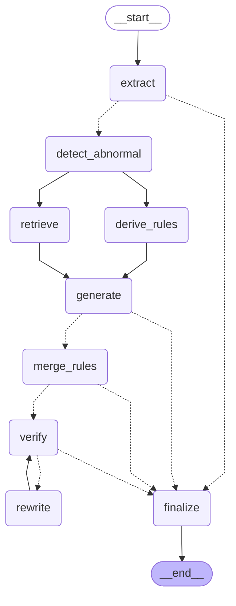

# Tagging workflow (LangGraph)

Generated by `python graph_workflow.py --mermaid docs/graph.md` from the compiled graph.
Dashed edges are conditional. `derive_rules` and `retrieve` run in the same superstep;
`verify -> rewrite -> verify` runs at most `MAX_REWRITES` (1) times, then anything still
unsupported is dropped in `finalize`. The rewrite loop is **off by default**
(`config.VERIFY_REWRITE=0`; enable with `VERIFY_REWRITE=1` or `run_graph(rewrite=True)`): on the
synthetic quick set it rescued 3 of 59 unsupported tags (+3 pts advice relevance) for ~7-9 s per
affected report. With it off, `verify` routes straight to `finalize`, which drops unsupported tags.

